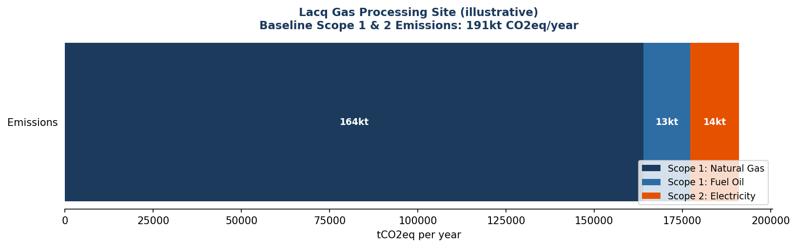
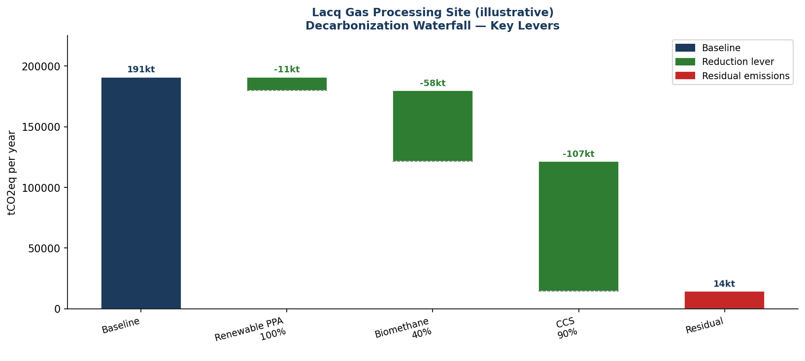
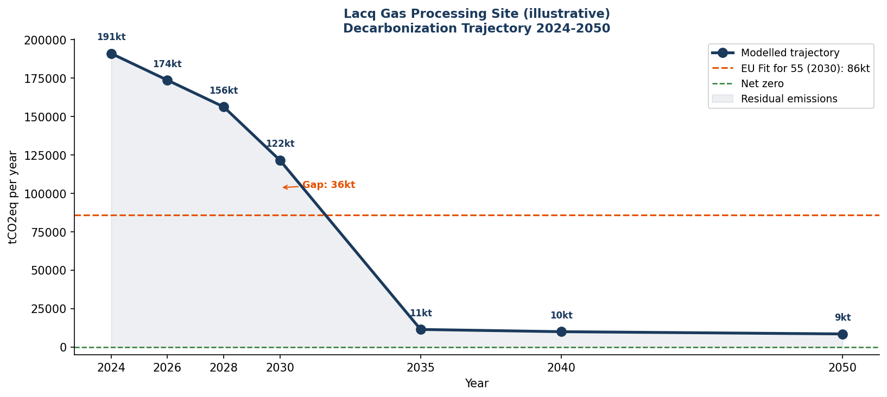

# Industrial Decarbonization Scenario Modeller

A Python-based scenario modelling tool for quantifying Scope 1 and Scope 2 
GHG emissions of energy-intensive industrial sites and simulating 
decarbonization trajectories under multiple intervention levers.

---

## Project Overview

This repository demonstrates an end-to-end environmental data pipeline:

- Scope 1 and 2 emissions calculation using ADEME Base Carbone v23 factors
- Scenario modelling — renewable PPA, biomethane, electrification, CCS
- Bioremediation vs chemical treatment carbon footprint comparison
- Biomethane lifecycle carbon intensity analysis by feedstock
- Decarbonization trajectory visualisation toward 2030 and 2050 targets
- Analytical monitoring carbon overhead quantification

The tool is designed to accept any industrial site configuration and produce 
reproducible, auditable decarbonization roadmaps.

---

## Scientific and Industrial Context

Decarbonization of energy-intensive industries requires simultaneous 
evaluation of multiple intervention levers, each with distinct carbon 
reduction potential, cost profile, and implementation timeline.

| Lever | Scope targeted | Mechanism | Typical reduction |
|---|---|---|---|
| Renewable electricity PPA | Scope 2 | Replace grid electricity | Up to 95% of Scope 2 |
| Biomethane substitution | Scope 1 | Replace natural gas | 10–90% of gas emissions |
| Process electrification | Scope 1 + 2 | Convert thermal to electric | Site-dependent |
| CCS on residual emissions | Scope 1 | Capture and store CO2 | Up to 90% of residual |

This project models these levers individually and in combination, producing 
waterfall abatement charts and trajectory plots aligned with EU climate targets.

A unique module compares the carbon footprint of bacterial bioremediation 
versus Fenton chemical oxidation for hydrocarbon-contaminated coastal marine 
sites, using experimental degradation data from Gulumbe, Cravo-Laureau & 
Duran (2025) as the foreground inventory.

**Illustrative case study — Lacq petrochemical site, Nouvelle-Aquitaine:**
- Baseline Scope 1 + 2: ~250,000 tCO2eq/year (illustrative)
- 2030 target: −55% under EU Fit for 55
- 2050 target: net zero

---

## Results

### Baseline Scope 1 and 2 breakdown

Natural gas combustion dominates Scope 1 at petrochemical sites, while 
the French nuclear-heavy electricity grid produces relatively low Scope 2 
emissions — making fuel switching and biomethane substitution the priority levers.

### Decarbonization waterfall

Each lever's contribution to total abatement is shown sequentially, from 
baseline to residual emissions after all interventions are applied.

### Trajectory toward net zero

Modelled annual emissions from 2024 to 2050 under the combined deployment 
plan, with EU 2030 and net-zero reference lines.

### Bioremediation vs chemical treatment

Carbon footprint per m³ treated for bacterial bioremediation versus Fenton 
oxidation, scaled to a 2,000 m³ contaminated coastal marine site.

---

## Methods

Python stack:

- pandas — data structures and tabular outputs
- numpy — numerical calculations
- matplotlib — scientific visualisation
- seaborn — statistical graphics

Emission factors: ADEME Base Carbone v23  
Regulatory references: EU Fit for 55, EU CSRD, GHG Protocol Corporate Standard

Scope 1 — direct combustion emissions:

E = Activity (MWh) × Emission factor (kgCO2eq/MWh) / 1000

Scope 2 — purchased electricity, location-based method:

E = Electricity (MWh) × Grid emission factor (kgCO2eq/MWh) / 1000

Biomethane carbon intensity varies by feedstock (kgCO2eq/MWh):

| Feedstock | EF (kgCO2eq/MWh) |
|---|---|
| Agricultural waste | 23 |
| Food waste | 18 |
| Sewage sludge | 28 |
| Energy crops | 45 |

---

## Data Note

Site energy consumption values are illustrative, based on published 
TotalEnergies Nouvelle-Aquitaine reporting ranges and French industrial 
sector benchmarks. All emission factors are sourced from ADEME Base Carbone 
v23, the official French national database.

The bioremediation module uses experimental degradation data from 
Gulumbe et al. (2025), conducted at IPREM CNRS UMR 5254 under supervision 
of corresponding author Prof. Robert Duran.

This pipeline is designed to accept real site energy audit data without 
structural changes.

---

## Why This Project Matters

This project demonstrates the ability to translate industrial energy 
consumption data into actionable decarbonization roadmaps using reproducible 
Python workflows.

It reflects:

- Quantitative environmental assessment of industrial systems
- Understanding of EU climate policy and carbon accounting methodology
- Integration of bioremediation science into carbon footprint analysis
- Clear communication of complex multi-lever scenarios to non-technical audiences

These skills are directly transferable to carbon consulting, industrial 
sustainability analysis, and environmental project management roles.

---

## References

Gulumbe, B.H., Cravo-Laureau, C. & Duran, R. (2025). Integrative genomic 
and transcriptomic analyses reveal marine *Actinomycetota* adaptations for 
hydrocarbon degradation. *Environmental Technology & Innovation*, 40, 104361.  
https://doi.org/10.1016/j.eti.2025.104361

ADEME (2026). Base Carbone v23 — Facteurs d'émissions de référence.  
https://www.bilans-ges.ademe.fr/

European Commission (2021). Fit for 55 package — EU climate targets for 2030.

---

## Author

Emma McCallum  
Environmental Analytical Chemistry & Microbiology  
GREEN Graduate Programme — IPREM CNRS UMR 5254  
Université de Pau et des Pays de l'Adour, France

LinkedIn: https://linkedin.com/in/ecmccallum  
GitHub: https://github.com/ecmccallum

---

